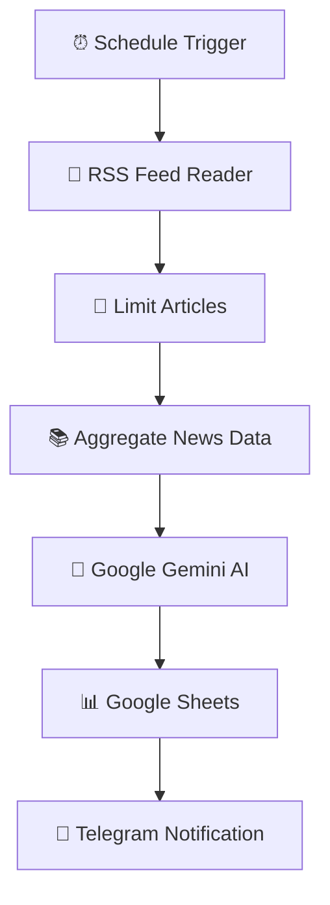

# 📰 AI Daily Tech News Summarizer — n8n Automation


An AI-powered news aggregation and summarization workflow built using **n8n**, **Google Gemini AI**, **RSS Feed**, **Google Sheets**, and **Telegram Bot API**.

This system automatically collects the latest cybersecurity and technology news, processes multiple articles using artificial intelligence, generates concise summaries, stores the results in Google Sheets, and delivers a daily technology digest directly to Telegram.

**Stack:**
n8n · RSS Feed · Google Gemini AI · Google Sheets · Telegram Bot · JavaScript · AI Automation

---

# 🎯 Project Overview

## Problem

Keeping up with rapidly changing technology and cybersecurity news requires manually checking multiple websites every day.

Common challenges:

* Time-consuming news searching
* Difficulty tracking multiple sources
* Information overload
* Missing important cybersecurity updates
* Manual creation of daily reports

Examples:

* Security vulnerabilities
* AI technology updates
* Software releases
* Industry announcements

---

## Solution

This project creates an automated AI-powered news monitoring system by:

1. Running automatically on a scheduled time
2. Fetching the latest technology news through RSS feeds
3. Selecting relevant articles for processing
4. Combining multiple articles into structured data
5. Using Google Gemini AI to generate summaries
6. Saving generated reports into Google Sheets
7. Sending daily news digests through Telegram

The workflow acts as an intelligent news assistant that automatically gathers, summarizes, and delivers important technology updates.

---

# ✨ Features

## News Collection

✅ Automated daily news retrieval
✅ RSS feed integration
✅ Cybersecurity and technology monitoring
✅ Latest article extraction

## Artificial Intelligence

✅ Google Gemini AI summarization
✅ Multi-article analysis
✅ AI-generated news digest
✅ Key information extraction

## Data Management

✅ Google Sheets news archive
✅ Structured summary storage
✅ Automated reporting database

## Notifications

✅ Telegram daily digest delivery
✅ Real-time automated reports
✅ Mobile-friendly news updates

---

# 🗺️ System Architecture



---

# 🏗️ Workflow Implementation

# Workflow 1: AI News Summarization Pipeline

## Node 1 — Schedule Trigger

### Purpose

Automatically starts the workflow at a predefined schedule.

Configuration:

```text
Trigger:

Daily Schedule


Execution:

Every Day
```

Example:

```text
Run Time:

08:00 AM Daily
```

---

# Node 2 — RSS Feed Read

### Purpose

Collect the latest cybersecurity and technology news from external RSS sources.

Example Source:

```text
https://feeds.feedburner.com/TheHackersNews
```

Captured Information:

| Field          | Description         |
| -------------- | ------------------- |
| Title          | News headline       |
| Link           | Article URL         |
| Content        | Article description |
| Published Date | Release timestamp   |

Example Output:

```json
{
"title":
"Critical Security Vulnerability Discovered",

"content":
"A new vulnerability affects multiple systems..."
}
```

---

# Node 3 — Limit

### Purpose

Controls the number of articles processed by the AI model.

Example Configuration:

```text
Maximum Items:

5 Articles
```

Benefits:

* Reduces AI processing cost
* Keeps summaries focused
* Improves report readability

---

# Node 4 — Aggregate

### Purpose

Combines multiple RSS articles into a structured format before sending them to Google Gemini AI.

Processing:

```text
Multiple News Articles

        ↓

Data Aggregation

        ↓

Combined AI Prompt
```

Example:

```json
[
{
"title":
"AI Security Update",

"content":
"Researchers discovered..."
},

{
"title":
"New Software Release",

"content":
"Company announced..."
}
]
```

---

# Node 5 — Google Gemini AI (Basic LLM Chain)

### Purpose

Analyze and summarize collected news articles using artificial intelligence.

The AI performs:

* Article summarization
* Key point extraction
* Information organization
* Daily digest generation

Example Response:

```text
📰 Daily AI & Tech News


1. AI Security Update

Researchers discovered a new security issue affecting AI systems.


2. Major Software Release

A technology company released a new update improving system performance.


🤖 Generated automatically using Google Gemini AI.
```

---

# Node 6 — Google Sheets

### Purpose

Store AI-generated news summaries for future reference and tracking.

Database Structure:

| Field     | Description           |
| --------- | --------------------- |
| Date      | Report date           |
| Headlines | Collected news titles |
| Summary   | AI-generated digest   |

Example:

| Date       | Headlines             | Summary                   |
| ---------- | --------------------- | ------------------------- |
| 2026-07-11 | Cybersecurity Updates | AI-generated daily report |

---

# Node 7 — Telegram Notification

### Purpose

Deliver the generated daily technology digest directly to Telegram.

Example:

```text
📰 Daily AI & Tech News


1. Oracle Security Vulnerability

A critical security issue was discovered and requires immediate attention.


2. AI Browser Extension Threat

A malicious AI extension was removed after collecting user information.


3. New Technology Update

A company introduced new features improving user privacy.


🤖 Automatically generated using n8n + Google Gemini AI.
```

---

# 🔐 Credentials Required

| Service              | Purpose                  |
| -------------------- | ------------------------ |
| RSS Feed Source      | Retrieve technology news |
| Google Gemini API    | AI summarization         |
| Google Sheets OAuth2 | Store summaries          |
| Telegram Bot API     | Send notifications       |
| n8n Instance         | Workflow execution       |

---

# ⚙️ Setup Guide

## 1. Configure Schedule Trigger

Set the execution schedule.

Required:

```text
Schedule Time

Timezone Configuration

Workflow Activation
```

---

## 2. Configure RSS Feed

Add an RSS source.

Example:

```text
Cybersecurity News RSS Feed

https://feeds.feedburner.com/TheHackersNews
```

Test article retrieval.

---

## 3. Configure Google Gemini AI

Create Gemini API credentials.

Required:

```text
Google AI API Key

Gemini Model Access
```

Test AI summarization output.

---

## 4. Create Google Sheets Database

Create:

```text
AI Tech News Archive
```

Columns:

```text
Date

Headlines

Summary
```

---

## 5. Configure Telegram Bot

Steps:

1. Create Telegram bot using BotFather
2. Copy bot token
3. Add Telegram credential in n8n
4. Configure chat ID

---

## 6. Import Workflow

Import:

```text
workflow.json
```

Configure:

* RSS Feed
* Gemini API
* Google Sheets
* Telegram Bot

Activate workflow.

---

# 🧪 Testing Checklist

| Test Case                 | Expected Result         |
| ------------------------- | ----------------------- |
| Schedule Trigger runs     | Workflow starts         |
| RSS retrieves articles    | News data received      |
| Limit filters articles    | Correct number selected |
| Aggregate combines data   | AI-ready format created |
| Gemini processes articles | Summary generated       |
| Google Sheets updates     | Report saved            |
| Telegram sends message    | News digest received    |

---

# 📁 Repository Structure

```text
AI-Daily-Tech-News-Summarizer/

│
├── README.md
│
├── workflow.json
│
├── screenshots/
│   │
│   ├── workflow.png
│   ├── rss-feed-output.png
│   ├── gemini-output.png
│   ├── google-sheets.png
│   ├── telegram-notification.png
│   └── execution-result.png
│
└── LICENSE
```

---

# 📸 Screenshots

Recommended screenshots:

* Complete workflow
* RSS Feed output
* Gemini AI summary generation
* Google Sheets records
* Telegram news digest
* Workflow execution result

---

# 🚀 Future Improvements

| Feature                | Implementation                                      |
| ---------------------- | --------------------------------------------------- |
| Multiple RSS Sources   | Monitor additional technology websites              |
| AI News Categorization | Classify AI, cybersecurity, hardware, software news |
| Sentiment Analysis     | Analyze technology trends                           |
| Web Dashboard          | Create analytics dashboard                          |
| Email Newsletter       | Send daily reports through Gmail                    |
| Notion Integration     | Create personal knowledge database                  |
| AI Trend Detection     | Identify emerging technology topics                 |

---

# 🎓 Skills Applied

## Automation

* n8n Workflow Automation
* Scheduled workflows
* Data processing pipelines

## Artificial Intelligence

* Google Gemini AI
* Prompt Engineering
* Text summarization
* AI-generated reporting

## APIs & Integrations

* RSS Feed Integration
* Google Sheets API
* Telegram Bot API

## Programming

* JavaScript
* JSON data handling
* Workflow logic
* Data transformation

## Business Automation

* Automated reporting systems
* Information management
* Productivity automation

---

# 📚 Learning Objectives

This project demonstrates:

* Building AI-powered content automation workflows
* Integrating external data sources with n8n
* Processing and summarizing large text data
* Automating daily reporting systems
* Connecting AI services with productivity tools

---

# 🙌 Acknowledgements

* n8n
* Google Gemini AI
* RSS Feed Providers
* Google Sheets API
* Telegram Bot API

---

# 👨‍💻 Author

**Belio C. Sinangote**

BS Information Technology Student
Cebu Technological University (CTU)

GitHub:

https://github.com/belioautomation

This project is part of my **30-Day n8n Automation Portfolio**, showcasing practical automation solutions using **n8n, AI integrations, APIs, and business workflow automation**.

---

# 📄 License

MIT License
